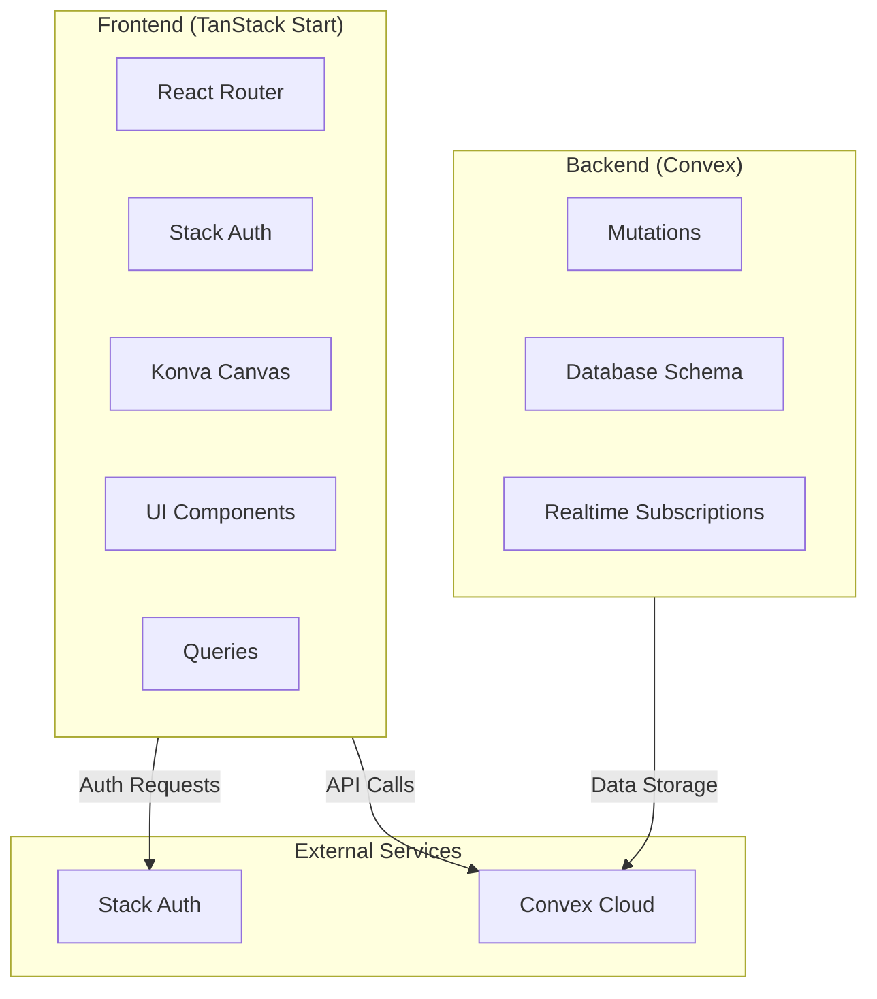
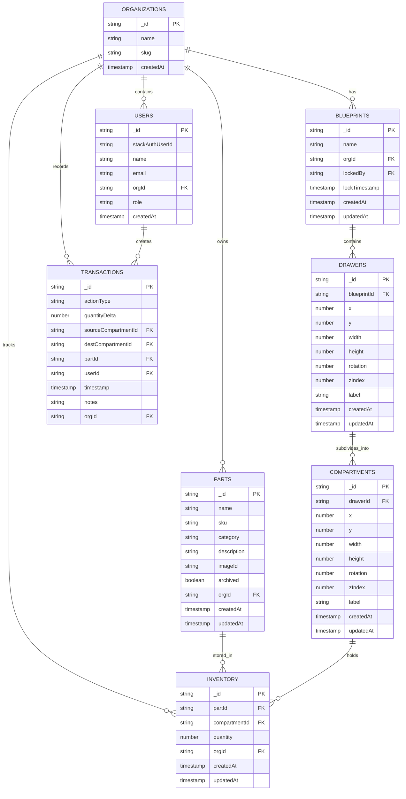
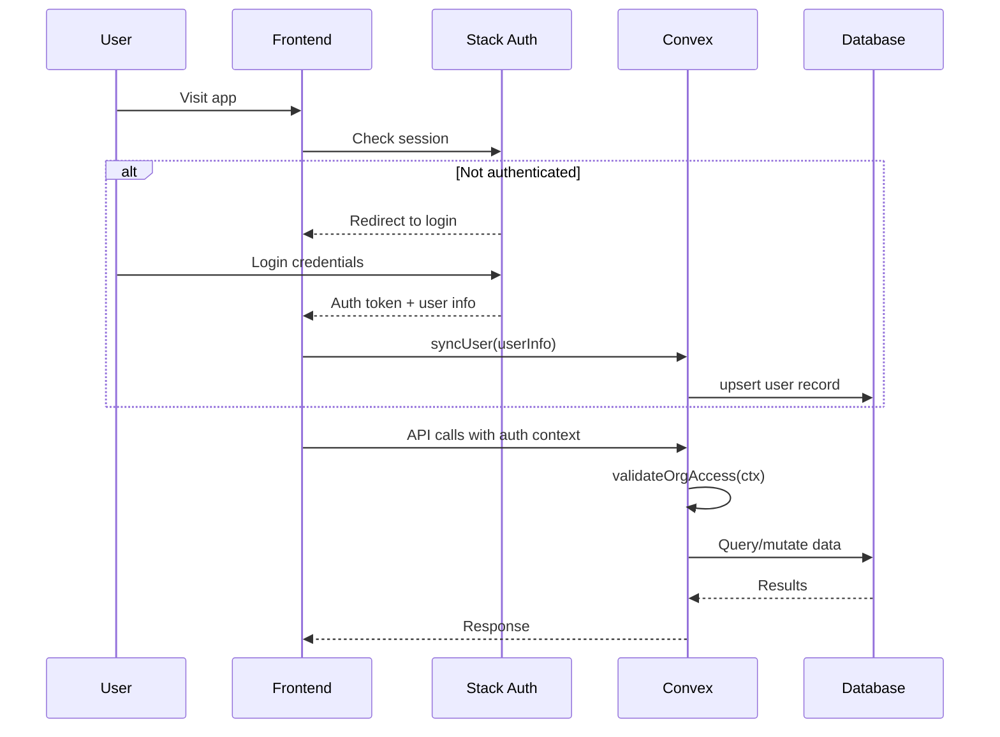

# Inventory Tracker Architecture

## System Overview

A multi-user inventory management system with interactive 2D blueprint visualization.



## Database Schema



## File Structure

```
/
├── convex/
│   ├── schema.ts           # Database schema definitions
│   ├── auth.ts             # Stack Auth integration
│   ├── auth_helpers.ts     # Authorization utilities
│   ├── http.ts             # HTTP actions (if needed)
│   ├── storage.ts          # File storage configuration
│   ├── users/
│   │   ├── queries.ts
│   │   └── mutations.ts
│   ├── parts/
│   │   ├── queries.ts
│   │   └── mutations.ts
│   ├── blueprints/
│   │   ├── queries.ts
│   │   └── mutations.ts
│   ├── drawers/
│   │   ├── queries.ts
│   │   └── mutations.ts
│   ├── compartments/
│   │   ├── queries.ts
│   │   └── mutations.ts
│   ├── inventory/
│   │   ├── queries.ts
│   │   └── mutations.ts
│   └── transactions/
│       └── queries.ts
├── src/
│   ├── components/
│   │   ├── auth/
│   │   ├── blueprints/
│   │   ├── inventory/
│   │   ├── parts/
│   │   └── ui/
│   ├── hooks/
│   │   ├── useAuth.ts
│   │   ├── useBlueprint.ts
│   │   └── useInventory.ts
│   ├── lib/
│   │   ├── auth.ts
│   │   ├── convex.ts
│   │   └── utils.ts
│   ├── routes/
│   │   ├── __root.tsx
│   │   ├── index.tsx
│   │   ├── login.tsx
│   │   ├── dashboard.tsx
│   │   ├── parts/
│   │   ├── blueprints/
│   │   ├── inventory/
│   │   └── transactions/
│   └── types/
│       └── index.ts
└── plans/
    └── architecture.md
```

## Authorization Flow



## Role-Based Permissions

| Feature | Admin | Editor | Viewer |
|---------|-------|--------|--------|
| View Blueprints | ✅ | ✅ | ✅ |
| Edit Blueprints | ✅ | ✅ | ❌ |
| Create Parts | ✅ | ✅ | ❌ |
| Edit Parts | ✅ | ✅ | ❌ |
| Archive Parts | ✅ | ✅ | ❌ |
| Check-in/out | ✅ | ✅ | ❌ |
| Move Parts | ✅ | ✅ | ❌ |
| Adjust Quantity | ✅ | ❌ | ❌ |
| View Transactions | ✅ | ✅ | ✅ |

## Key Technical Decisions

1. **Organization-scoped data**: All data filtered by orgId at query level
2. **Immutable transactions**: Transaction records cannot be modified or deleted
3. **Blueprint locking**: Only one user can edit a blueprint at a time
4. **Server-side validation**: All mutations validate permissions and data integrity
5. **Realtime updates**: Convex subscriptions for live collaboration
6. **Canvas coordinates**: Store geometry in blueprint coordinate system, transform for display
