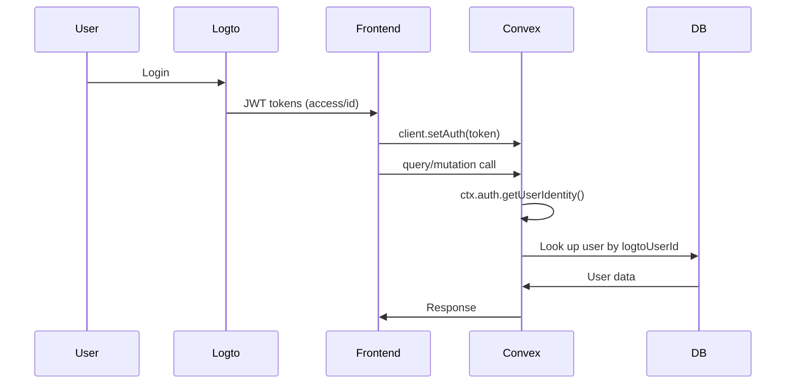
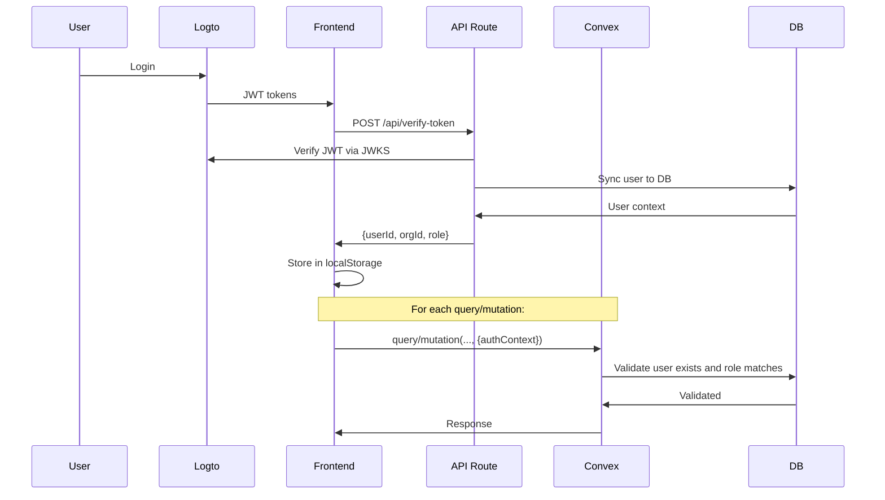

# Logto Authentication Migration Architecture

## Executive Summary

This document outlines the architecture for migrating from Convex `ctx.auth` to Logto-based API route authentication using TanStack Router. The migration replaces Convex's built-in authentication with a custom implementation where:

1. TanStack Router API routes verify Logto JWT tokens using `jose`
2. Verified user context (userId, orgId, role) is passed to Convex queries/mutations as arguments
3. Convex functions validate the provided context against the database
4. Frontend stores user context in localStorage and includes it in all Convex calls

**Key Change:** Convex functions no longer call `ctx.auth.getUserIdentity()` — instead, they receive user context as arguments and validate it by looking up the user in the database.

---

## Architecture Overview

### Current Auth Flow (To Be Replaced)



### New Auth Flow



---

## 1. New API Route Specifications

### 1.1 Primary Endpoint: `/api/verify-token`

**Purpose:** Verify Logto access token, sync user to database, return user context

**File:** `src/routes/api/verify-token.ts`

#### Request Interface

```typescript
interface VerifyTokenRequest {
  accessToken: string              // Logto access token or ID token (JWT)
  idTokenClaims?: LogtoTokenClaims // Optional: parsed ID token claims
  userInfo?: LogtoUserInfo         // Optional: user info from Logto
}

interface LogtoTokenClaims {
  sub: string           // Logto user ID
  aud: string           // Audience
  iss: string           // Issuer URL
  exp: number           // Expiration timestamp
  iat: number           // Issued at timestamp
  roles?: string[]      // Custom role claims
  organization_id?: string  // Custom org claim
  client_id: string
}

interface LogtoUserInfo {
  sub: string
  email?: string
  name?: string
  picture?: string
  email_verified?: boolean
  username?: string
}
```

#### Response Interface

```typescript
interface VerifyTokenResponse {
  success: boolean
  user?: AuthenticatedUser
  error?: string
}

interface AuthenticatedUser {
  _id: string                  // Convex user ID
  logtoUserId: string          // Logto subject
  name: string
  email: string
  orgId: string                // Convex org ID
  orgName: string              // Organization name
  role: UserRole               // 'Admin' | 'Editor' | 'Member' | 'Viewer'
}

type UserRole = 'Admin' | 'Editor' | 'Member' | 'Viewer'
```

#### Error Handling

```typescript
interface TokenVerificationError {
  code: 'INVALID_TOKEN' | 'EXPIRED_TOKEN' | 'MALFORMED_TOKEN' | 'SERVER_ERROR'
  message: string
}

// HTTP Status Codes
// 400 - Bad Request (missing required fields)
// 401 - Unauthorized (invalid/expired token)
// 500 - Internal Server Error (database/sync failure)
```

#### Token Verification Logic

```typescript
import { jwtVerify, createRemoteJWKSet } from 'jose'

// Environment variables
const LOGTO_ENDPOINT = process.env.VITE_LOGTO_ENDPOINT
const LOGTO_ISSUER = `${LOGTO_ENDPOINT}/oidc`
const JWKS_URL = `${LOGTO_ISSUER}/jwks`

// Verification steps:
// 1. Strip "Bearer " prefix if present
// 2. Create JWKS from Logto's public keys
// 3. Verify JWT signature and claims
// 4. Extract user info (sub, email, name, roles, organization_id)
// 5. Call Convex to sync user to database
// 6. Return user context

const jwks = createRemoteJWKSet(new URL(JWKS_URL))

const { payload } = await jwtVerify(token, jwks, {
  issuer: LOGTO_ISSUER,
  audience: payload.aud // Use token's audience
})

// Extract custom claims
const logtoUserId = payload.sub
const roles = payload.roles || []
const orgId = payload.organization_id
```

### 1.2 Optional Endpoint: `/api/refresh-token`

**Purpose:** Refresh expired access tokens using refresh token

**File:** `src/routes/api/refresh-token.ts`

#### Request Interface

```typescript
interface RefreshTokenRequest {
  refreshToken: string
}
```

#### Response Interface

```typescript
interface RefreshTokenResponse {
  success: boolean
  accessToken?: string
  expiresIn?: number
  error?: string
}
```

**Note:** This endpoint requires integrating with Logto's token endpoint directly. Can be added in Phase 3 if needed.

---

## 2. Updated Auth Helpers Design

### 2.1 New Interface: `AuthContext`

Create a new type to represent authenticated user context passed to Convex functions:

```typescript
// File: convex/types/auth.ts

/**
 * Authentication context passed from frontend to Convex
 * Contains verified user information that functions can validate
 */
export interface AuthContext {
  userId: string              // Convex user document ID
  logtoUserId: string         // Logto subject (for verification)
  orgId: string               // Convex org ID
  role: UserRole              // User's role
  timestamp: number           // When this context was generated (for staleness check)
}

export type UserRole = 'Admin' | 'Editor' | 'Member' | 'Viewer'
```

### 2.2 Updated `convex/auth_helpers.ts`

Replace `ctx.auth.getUserIdentity()` calls with validation of passed `AuthContext`:

```typescript
import { v } from 'convex/values'
import { query, mutation } from './_generated/server'
import { Doc, Id } from './_generated/dataModel'
import type { QueryCtx } from './_generated/server'
import type { AuthContext } from './types/auth'

/**
 * Role hierarchy for permission checking
 */
const ROLE_HIERARCHY: Record<string, number> = {
  Viewer: 1,
  Member: 2,
  Editor: 3,
  Admin: 4,
}

/**
 * Validates the provided auth context by checking the user in the database
 * Returns the full user context including org data
 */
export async function validateAuthContext(
  ctx: QueryCtx,
  authContext: AuthContext
): Promise<UserContext> {
  // Verify user exists in database
  const user = await ctx.db.get('users', authContext.userId as Id<'users'>)
  
  if (!user) {
    throw new Error(`Unauthorized: User ${authContext.userId} not found`)
  }

  // Verify logtoUserId matches (prevents context spoofing)
  if (user.logtoUserId !== authContext.logtoUserId) {
    throw new Error(`Unauthorized: Invalid logtoUserId`)
  }

  // Verify orgId matches (prevents org context spoofing)
  if (user.orgId !== authContext.orgId) {
    throw new Error(`Unauthorized: Invalid orgId`)
  }

  // Verify role matches (prevents privilege escalation)
  if (user.role !== authContext.role) {
    throw new Error(`Unauthorized: Invalid role`)
  }

  // Optional: Check context staleness (reject contexts older than 5 minutes)
  const MAX_CONTEXT_AGE = 5 * 60 * 1000 // 5 minutes
  const age = Date.now() - authContext.timestamp
  if (age > MAX_CONTEXT_AGE) {
    throw new Error(`Unauthorized: Auth context expired`)
  }

  // Get organization
  const org = await ctx.db.get('organizations', user.orgId)
  if (!org) {
    throw new Error(`Unauthorized: Organization ${user.orgId} not found`)
  }

  const roleLevel = ROLE_HIERARCHY[user.role] || 1

  return {
    user,
    org,
    role: user.role,
    roleLevel,
  }
}

/**
 * Gets the current user from validated auth context
 * Replaces original getCurrentUser() that used ctx.auth
 */
export async function getCurrentUser(
  ctx: QueryCtx,
  authContext: AuthContext
): Promise<UserContext> {
  return validateAuthContext(ctx, authContext)
}

/**
 * Validates that the current user has access to the specified organization
 */
export async function validateOrgAccess(
  ctx: QueryCtx,
  authContext: AuthContext,
  orgId: Id<'organizations'>
): Promise<UserContext> {
  const userContext = await validateAuthContext(ctx, authContext)

  if (userContext.user.orgId !== orgId) {
    throw new Error(
      `Forbidden: User does not have access to organization ${orgId}`
    )
  }

  return userContext
}

/**
 * Requires the current user to have at least the specified role level
 */
export async function requireRole(
  ctx: QueryCtx,
  authContext: AuthContext,
  requiredRole: UserRole
): Promise<UserContext> {
  const userContext = await validateAuthContext(ctx, authContext)

  const requiredLevel = ROLE_HIERARCHY[requiredRole]
  if (userContext.roleLevel < requiredLevel) {
    throw new Error(
      `Forbidden: User requires ${requiredRole} role or higher. Current role: ${userContext.role}`
    )
  }

  return userContext
}

/**
 * Requires the current user to have at least the specified role within a specific org
 */
export async function requireOrgRole(
  ctx: QueryCtx,
  authContext: AuthContext,
  orgId: Id<'organizations'>,
  requiredRole: UserRole
): Promise<UserContext> {
  const userContext = await validateOrgAccess(ctx, authContext, orgId)

  const requiredLevel = ROLE_HIERARCHY[requiredRole]
  if (userContext.roleLevel < requiredLevel) {
    throw new Error(
      `Forbidden: User requires ${requiredRole} role or higher in this organization. Current role: ${userContext.role}`
    )
  }

  return userContext
}

/**
 * Internal mutation to sync a user from Logto to our database
 * (Keep existing implementation - no changes needed)
 */
export const syncUserInternal = internalMutation({
  // ... existing implementation remains unchanged
})

/**
 * Query to get the current user's profile (with auth context)
 */
export const getMyProfile = query({
  args: {
    authContext: v.object({
      userId: v.id('users'),
      logtoUserId: v.string(),
      orgId: v.id('organizations'),
      role: v.union(
        v.literal('Admin'),
        v.literal('Editor'),
        v.literal('Member'),
        v.literal('Viewer')
      ),
      timestamp: v.number(),
    }),
  },
  returns: v.union(
    v.object({
      user: v.object({
        _id: v.id('users'),
        _creationTime: v.number(),
        logtoUserId: v.string(),
        name: v.string(),
        email: v.string(),
        orgId: v.id('organizations'),
        role: v.union(
          v.literal('Admin'),
          v.literal('Editor'),
          v.literal('Member'),
          v.literal('Viewer')
        ),
        createdAt: v.number(),
      }),
      org: v.object({
        _id: v.id('organizations'),
        _creationTime: v.number(),
        name: v.string(),
        slug: v.string(),
        createdAt: v.number(),
      }),
    }),
    v.null()
  ),
  handler: async (ctx, args) => {
    const userContext = await validateAuthContext(ctx, args.authContext)
    return {
      user: userContext.user,
      org: userContext.org,
    }
  },
})
```

### 2.3 Query/Mutation Signature Changes

All queries and mutations that call auth helpers must now accept `authContext` as an argument:

**Before:**
```typescript
export const listParts = query({
  args: {
    orgId: v.id('organizations'),
  },
  handler: async (ctx, args) => {
    const userContext = await getCurrentUser(ctx)
    // ... rest of logic
  },
})
```

**After:**
```typescript
export const listParts = query({
  args: {
    orgId: v.id('organizations'),
    authContext: v.object({
      userId: v.id('users'),
      logtoUserId: v.string(),
      orgId: v.id('organizations'),
      role: v.union(v.literal('Admin'), v.literal('Editor'), v.literal('Member'), v.literal('Viewer')),
      timestamp: v.number(),
    }),
  },
  handler: async (ctx, args) => {
    const userContext = await getCurrentUser(ctx, args.authContext)
    // ... rest of logic
  },
})
```

---

## 3. Provider/Context Changes

### 3.1 Updated `src/integrations/convex/provider.tsx`

Remove `client.setAuth()` since tokens are now passed via arguments, not headers:

```typescript
import { ConvexProvider } from 'convex/react'
import { ConvexQueryClient } from '@/integrations/convex/react-query'
import { useMemo } from 'react'

const CONVEX_URL = (import.meta as any).env.VITE_CONVEX_URL

/**
 * Simplified ConvexProvider - no auth token management
 * Tokens are passed via query/mutation arguments from frontend
 */
export default function AppConvexProvider({
  children,
}: {
  children: React.ReactNode
}) {
  const convexClient = useMemo(() => {
    const client = new ConvexQueryClient(CONVEX_URL).convexClient
    
    // No setAuth() - tokens are passed as arguments
    return client
  }, [])

  return <ConvexProvider client={convexClient}>{children}</ConvexProvider>
}
```

### 3.2 Updated `src/hooks/useAuth.tsx`

Add auth context management:

```typescript
import { useState, useEffect, useCallback, useMemo, useContext } from 'react'
import { useLogto } from '@logto/react'
import type { User, UserRole } from '@/types'
import {
  AuthContext,
  type AuthContextValue,
  type LogtoUserInfo,
  type LogtoTokenClaims,
  logtoAuthConfig,
  getConvexUser,
  setConvexUser,
  clearConvexUser,
} from '../lib/auth'
import type { AuthContext as ConvexAuthContext } from '@/types/auth'

// Storage key for auth context
export const AUTH_CONTEXT_KEY = 'inventory_tracker_auth_context'

/**
 * Get stored auth context from localStorage
 */
function getStoredAuthContext(): ConvexAuthContext | null {
  if (typeof window === 'undefined') return null
  
  try {
    const stored = localStorage.getItem(AUTH_CONTEXT_KEY)
    return stored ? JSON.parse(stored) : null
  } catch {
    return null
  }
}

/**
 * Store auth context in localStorage
 */
function setStoredAuthContext(context: ConvexAuthContext): void {
  if (typeof window === 'undefined') return
  
  try {
    localStorage.setItem(AUTH_CONTEXT_KEY, JSON.stringify(context))
  } catch {
    // Storage might be full
  }
}

/**
 * Clear auth context from localStorage
 */
function clearStoredAuthContext(): void {
  if (typeof window === 'undefined') return
  
  try {
    localStorage.removeItem(AUTH_CONTEXT_KEY)
  } catch {
    // Ignore errors
  }
}

/**
 * Logto Auth Provider
 */
export function AuthProvider({ children }: { children: React.ReactNode }) {
  const [user, setUser] = useState<User | null>(null)
  const [logtoUser, setLogtoUser] = useState<LogtoUserInfo | null>(null)
  const [authContext, setAuthContext] = useState<ConvexAuthContext | null>(null)
  const [isLoading, setIsLoading] = useState(true)
  const [error, setError] = useState<string | null>(null)

  const {
    isAuthenticated: logtoAuthenticated,
    isLoading: logtoLoading,
    getAccessToken,
    getIdTokenClaims,
    fetchUserInfo,
    signOut,
  } = useLogto()

  // Initialize auth state from storage on mount
  useEffect(() => {
    const initAuth = async () => {
      try {
        // Restore user from storage
        const storedUser = getConvexUser()
        const storedContext = getStoredAuthContext()
        
        if (storedUser && storedContext) {
          setUser(storedUser)
          setAuthContext(storedContext)
        }

        // If Logto is authenticated, verify token and sync user
        if (logtoAuthenticated && !logtoLoading) {
          const userInfo = await fetchUserInfo()
          setLogtoUser(userInfo as LogtoUserInfo)

          const idToken = await getAccessToken() // or getIdToken()
          const idTokenClaims = await getIdTokenClaims()
          
          if (idToken && idTokenClaims) {
            const result = await verifyLogtoToken(
              idToken,
              idTokenClaims as LogtoTokenClaims,
              userInfo as LogtoUserInfo
            )
            
            if (result.success && result.user) {
              setUser(result.user)
              setConvexUser(result.user)
              
              // Create and store auth context
              const newAuthContext: ConvexAuthContext = {
                userId: result.user._id,
                logtoUserId: result.user.logtoUserId,
                orgId: result.user.orgId,
                role: result.user.role,
                timestamp: Date.now(),
              }
              setAuthContext(newAuthContext)
              setStoredAuthContext(newAuthContext)
            }
          }
        }
      } catch (err) {
        setError(err instanceof Error ? err.message : 'Failed to initialize auth')
      } finally {
        setIsLoading(false)
      }
    }

    initAuth()
  }, [logtoAuthenticated, logtoLoading, getAccessToken, getIdTokenClaims, fetchUserInfo])

  /**
   * Sign out from both Logto and our app
   */
  const signOutWithCleanup = useCallback(async () => {
    try {
      clearConvexUser()
      clearStoredAuthContext()
      setUser(null)
      setLogtoUser(null)
      setAuthContext(null)
      setError(null)

      await signOut()
    } catch (err) {
      setError(err instanceof Error ? err.message : 'Sign out failed')
    }
  }, [signOut])

  const value = useMemo(
    () => ({
      user,
      logtoUser,
      authContext,
      isAuthenticated: logtoAuthenticated,
      isLoading: isLoading || logtoLoading,
      error,
      signOut: signOutWithCleanup,
    }),
    [user, logtoUser, authContext, logtoAuthenticated, isLoading, logtoLoading, error, signOutWithCleanup]
  )

  return <AuthContext.Provider value={value}>{children}</AuthContext.Provider>
}

/**
 * Hook to access auth context
 */
export function useAuth(): AuthContextValue {
  const context = useContext(AuthContext)
  if (context === undefined) {
    throw new Error('useAuth must be used within an AuthProvider')
  }
  return context
}
```

### 3.3 Updated `src/lib/auth.ts`

Add auth context storage helpers:

```typescript
import { createContext, useContext } from 'react'
import type { LogtoConfig } from '@logto/react'
import type { User, UserRole } from '@/types'
import type { ConvexAuthContext } from '@/types/auth'

// ... existing LogtoAuthConfig, LogtoUserInfo, LogtoTokenClaims ...

export interface AuthContextValue {
  user: User | null
  logtoUser: LogtoUserInfo | null
  authContext: ConvexAuthContext | null
  isAuthenticated: boolean
  isLoading: boolean
  error: string | null
  hasRole: (role: UserRole) => boolean
  signOut: () => Promise<void>
}

export const AuthContext = createContext<AuthContextValue | undefined>(undefined)

export function useAuthContext(): AuthContextValue {
  const context = useContext(AuthContext)
  if (context === undefined) {
    throw new Error('useAuthContext must be used within an AuthProvider')
  }
  return context
}

// ... existing storage helpers ...
```

### 3.4 New Types File: `src/types/auth.ts`

```typescript
/**
 * Authentication context passed to Convex queries/mutations
 */
export interface ConvexAuthContext {
  userId: string
  logtoUserId: string
  orgId: string
  role: UserRole
  timestamp: number
}

export type UserRole = 'Admin' | 'Editor' | 'Member' | 'Viewer'
```

---

## 4. Frontend Query/Mutation Wrapper

### 4.1 Create `src/lib/convex-wrapper.ts`

Utility to automatically include auth context in all Convex calls:

```typescript
import { useAuth } from '@/hooks/useAuth'
import type { ConvexAuthContext } from '@/types/auth'

/**
 * Wraps Convex query/mutation to automatically include auth context
 */
export function useAuthenticatedConvex() {
  const { authContext, isAuthenticated } = useAuth()

  if (!isAuthenticated || !authContext) {
    throw new Error('Cannot use authenticated Convex - user not authenticated')
  }

  // Check context staleness
  const MAX_CONTEXT_AGE = 5 * 60 * 1000 // 5 minutes
  const age = Date.now() - authContext.timestamp
  if (age > MAX_CONTEXT_AGE) {
    console.warn('Auth context is stale, consider refreshing')
  }

  return { authContext }
}

/**
 * Type helper for adding auth context to query/mutation args
 */
export type WithAuthContext<T extends Record<string, unknown>> = T & {
  authContext: ConvexAuthContext
}

/**
 * Helper to prepare args with auth context
 */
export function withAuth<T extends Record<string, unknown>>(
  args: T,
  authContext: ConvexAuthContext
): WithAuthContext<T> {
  return {
    ...args,
    authContext,
  }
}
```

### 4.2 Usage Example in Components

```typescript
import { useQuery, useMutation } from '@tanstack/react-query'
import { useAuthenticatedConvex, withAuth } from '@/lib/convex-wrapper'

function PartList({ orgId }: { orgId: string }) {
  const { authContext } = useAuthenticatedConvex()
  const convex = useConvexQueryClient()

  const parts = useQuery({
    queryKey: ['parts', orgId],
    queryFn: () =>
      convex.query(
        api.parts.queries.list,
        withAuth({ orgId }, authContext)
      ),
  })

  // ... render
}
```

---

## 5. Migration Path

### Phase 1: Create New API Routes

1. Create `src/routes/api/verify-token.ts`
   - Implement JWT verification using `jose`
   - Implement user sync to Convex
   - Return auth context

2. Create `src/types/auth.ts`
   - Define `ConvexAuthContext` interface

3. Update `src/lib/auth.ts`
   - Add auth context to `AuthContextValue`
   - Update storage helpers

### Phase 2: Update Convex Auth Helpers

1. Create `convex/types/auth.ts`
   - Define `AuthContext` interface

2. Update `convex/auth_helpers.ts`
   - Replace `getCurrentUser()` to accept `AuthContext` argument
   - Replace `requireRole()`, `requireOrgRole()`, `validateOrgAccess()` similarly
   - Add `validateAuthContext()` helper
   - Update all exported queries/mutations to include `authContext` argument

3. Update all Convex query/mutation files
   - Add `authContext` to args schema
   - Update function calls to pass `authContext` to auth helpers
   - ~23 files need updating (blueprints, compartments, drawers, inventory, organizations, parts, etc.)

### Phase 3: Update Frontend

1. Update `src/integrations/convex/provider.tsx`
   - Remove `client.setAuth()` call
   - Simplify provider

2. Update `src/hooks/useAuth.tsx`
   - Add auth context state management
   - Store/retrieve auth context from localStorage
   - Call `/api/verify-token` after Logto authentication

3. Create `src/lib/convex-wrapper.ts`
   - Add helper utilities for including auth context in Convex calls

4. Update component queries/mutations
   - Use `useAuthenticatedConvex()` wrapper
   - Include auth context in all Convex calls
   - Update ~15-20 components

### Phase 4: Cleanup

1. Remove `convex/auth.ts` HTTP endpoints
   - `verifyLogtoToken` (moved to TanStack Router)
   - `logout` (no longer needed)
   - Keep `logtoWebhook` for Logto webhook integration

2. Update `convex/http.ts`
   - Remove routes for deleted endpoints

3. Remove unused imports and code

---

## 6. Security Considerations

### 6.1 Token Validation

**JWT Verification:**
- Use `jose` library with `createRemoteJWKSet()` for automatic key rotation
- Verify `iss` (issuer) matches Logto endpoint
- Verify `aud` (audience) matches expected value
- Verify `exp` (expiration) - reject expired tokens
- Verify `nbf` (not before) if present

```typescript
const { payload } = await jwtVerify(token, jwks, {
  issuer: LOGTO_ISSUER,
  audience: payload.aud,
})

// Additional checks
if (Date.now() / 1000 > payload.exp) {
  throw new Error('Token expired')
}
```

### 6.2 Context Validation

**Server-Side Validation:**
- Verify `userId` exists in database
- Verify `logtoUserId` matches database record (prevents spoofing)
- Verify `orgId` matches user's actual org
- Verify `role` matches database record (prevents privilege escalation)
- Implement timestamp staleness check (reject old contexts)

### 6.3 CORS Configuration

**TanStack Router API Routes:**
```typescript
export const Route = createFileRoute('/api/verify-token')({
  server: {
    handlers: {
      POST: async ({ request }): Promise<Response> => {
        // Handle CORS preflight
        if (request.method === 'OPTIONS') {
          return new Response(null, {
            status: 204,
            headers: {
              'Access-Control-Allow-Origin': window.location.origin,
              'Access-Control-Allow-Methods': 'POST, OPTIONS',
              'Access-Control-Allow-Headers': 'Content-Type, Authorization',
            },
          })
        }
        // ... handler logic
      },
    },
  },
})
```

**Environment-Based CORS:**
```typescript
const ALLOWED_ORIGINS = process.env.ALLOWED_ORIGINS?.split(',') || [
  'http://localhost:3000',
  'https://yourdomain.com',
]

const origin = request.headers.get('origin')
if (origin && !ALLOWED_ORIGINS.includes(origin)) {
  return new Response('Forbidden', { status: 403 })
}
```

### 6.4 Error Handling

**Never Leak Internal Details:**
- Don't return specific database errors to clients
- Use generic error messages for auth failures
- Log detailed errors server-side for debugging

```typescript
try {
  // ... verification logic
} catch (error) {
  console.error('[verify-token] Error:', error)
  
  // Return generic error to client
  return new Response(
    JSON.stringify({ error: 'Token verification failed' }),
    { status: 401, headers: { 'Content-Type': 'application/json' } }
  )
}
```

### 6.5 Token Storage

**Client-Side Storage:**
- Store access token in localStorage (already done by Logto)
- Store auth context in localStorage (userId, orgId, role)
- **Never** store refresh tokens in localStorage (use httpOnly cookies if implementing refresh)

### 6.6 Rate Limiting

**Optional (Recommended):**
Implement rate limiting on `/api/verify-token` to prevent brute force attacks:

```typescript
// Use a simple in-memory rate limiter or integrate with Redis
const rateLimiter = new Map<string, number[]>()

export const Route = createFileRoute('/api/verify-token')({
  server: {
    handlers: {
      POST: async ({ request }): Promise<Response> => {
        const ip = getClientIp(request)
        const now = Date.now()
        const windowMs = 60 * 1000 // 1 minute
        const maxRequests = 10
        
        const requests = rateLimiter.get(ip) || []
        const recentRequests = requests.filter(t => now - t < windowMs)
        
        if (recentRequests.length >= maxRequests) {
          return new Response('Too many requests', { status: 429 })
        }
        
        recentRequests.push(now)
        rateLimiter.set(ip, recentRequests)
        
        // ... verification logic
      },
    },
  },
})
```

---

## 7. File Structure Changes

### New Files

```
src/
├── routes/
│   └── api/
│       ├── verify-token.ts          # NEW: Token verification endpoint
│       └── refresh-token.ts         # NEW: Optional token refresh endpoint
├── lib/
│   ├── auth.ts                      # MODIFIED: Add auth context types
│   └── convex-wrapper.ts            # NEW: Helper for authenticated Convex calls
├── hooks/
│   └── useAuth.tsx                  # MODIFIED: Add auth context management
├── integrations/
│   └── convex/
│       └── provider.tsx             # MODIFIED: Remove setAuth()
└── types/
    ├── auth.ts                      # NEW: ConvexAuthContext type
    └── index.ts                     # MODIFIED: Export auth types

convex/
├── types/
│   └── auth.ts                      # NEW: AuthContext interface
├── auth_helpers.ts                  # MODIFIED: Update all auth functions
├── auth.ts                          # MODIFIED: Remove verifyLogtoToken, logout
└── http.ts                          # MODIFIED: Remove auth routes
```

### Files to Modify (Summary)

**Phase 1:**
- `src/routes/api/verify-token.ts` (already exists, enhance it)
- `src/lib/auth.ts`
- `src/types/auth.ts` (create)

**Phase 2:**
- `convex/types/auth.ts` (create)
- `convex/auth_helpers.ts`
- All Convex query/mutation files (~23 files):
  - `convex/blueprints/queries.ts`
  - `convex/blueprints/mutations.ts`
  - `convex/compartments/queries.ts`
  - `convex/compartments/mutations.ts`
  - `convex/drawers/queries.ts`
  - `convex/drawers/mutations.ts`
  - `convex/inventory/queries.ts`
  - `convex/inventory/mutations.ts`
  - `convex/organizations/queries.ts`
  - `convex/organizations/mutations.ts`
  - `convex/parts/queries.ts`
  - `convex/parts/mutations.ts`
  - `convex/blueprint_revisions/queries.ts`
  - `convex/blueprint_revisions/mutations.ts`
  - `convex/transactions/queries.ts`
  - etc.

**Phase 3:**
- `src/integrations/convex/provider.tsx`
- `src/hooks/useAuth.tsx`
- `src/lib/convex-wrapper.ts` (create)
- All components calling Convex (~15-20 files):
  - `src/routes/dashboard.tsx`
  - `src/routes/parts/index.tsx`
  - `src/routes/blueprints/index.tsx`
  - `src/routes/blueprints/$blueprintId.tsx`
  - `src/routes/inventory/index.tsx`
  - `src/routes/transactions/index.tsx`
  - `src/routes/admin/users/index.tsx`
  - `src/components/inventory/*.tsx`
  - `src/components/blueprint/*.tsx`
  - etc.

**Phase 4:**
- `convex/auth.ts`
- `convex/http.ts`

---

## 8. Dependencies

### Add

```bash
bun add jose  # Already in package.json (^6.1.3)
```

No new dependencies needed - `jose` is already installed.

### Remove

None - all existing dependencies are still used.

---

## 9. Key Design Decisions

### 9.1 Why Pass Auth Context as Arguments?

**Decision:** Pass `userId, logtoUserId, orgId, role` as Convex query/mutation arguments instead of using headers.

**Rationale:**
1. **Convex Limitations:** Convex functions cannot access HTTP headers directly
2. **Type Safety:** Arguments are strongly typed and validated by Convex
3. **Explicit:** Auth requirements are visible in function signatures
4. **Testable:** Easy to mock auth context in tests

**Alternative Considered:** Use a new Convex table to store active sessions. **Rejected** because:
- Requires additional database writes on every request
- Session cleanup complexity
- State conflicts with stateless JWT design

### 9.2 Why Include Timestamp in Auth Context?

**Decision:** Add `timestamp` field to `AuthContext` and reject stale contexts.

**Rationale:**
1. **Security:** Limits window for replay attacks
2. **Freshness:** Ensures users refresh context periodically
3. **Graceful Degradation:** 5-minute window allows for network delays

**Tradeoff:** Slight UX overhead - users may need to re-authenticate if context expires. Mitigated by automatic refresh in background.

### 9.3 Why Keep Convex User Sync?

**Decision:** Keep user synchronization to Convex database after Logto token verification.

**Rationale:**
1. **Authorization:** Role-based access control requires database records
2. **Organization Data:** Org membership stored in database, not Logto
3. **Audit Trail:** User actions reference Convex user IDs
4. **Flexibility:** Supports custom user attributes not in Logto

**Alternative:** Pull user data directly from Logto on every request. **Rejected** because:
- Adds latency (API call to Logto)
- Logto rate limits
- Doesn't support organization membership model

### 9.4 Why Not Use Convex Auth?

**Decision:** Move away from Convex `ctx.auth` entirely.

**Rationale:**
1. **Explicit Requirement:** User requested Logto-based auth
2. **Independence:** Reduces coupling to Convex auth system
3. **Portability:** Easier to migrate to other backends in future
4. **Control:** Full control over auth flow and error handling

---

## 10. Testing Strategy

### 10.1 Unit Tests

**Convex Auth Helpers:**
```typescript
describe('validateAuthContext', () => {
  it('should validate valid auth context', async () => {
    const context = { userId, logtoUserId, orgId, role, timestamp }
    const result = await validateAuthContext(mockCtx, context)
    expect(result.user).toBeDefined()
  })

  it('should reject invalid userId', async () => {
    const context = { userId: 'invalid', ... }
    await expect(validateAuthContext(mockCtx, context)).rejects.toThrow()
  })

  it('should reject stale context', async () => {
    const context = { userId, timestamp: Date.now() - 10 * 60 * 1000 }
    await expect(validateAuthContext(mockCtx, context)).rejects.toThrow()
  })
})
```

### 10.2 Integration Tests

**API Route:**
```typescript
describe('/api/verify-token', () => {
  it('should verify valid Logto token', async () => {
    const response = await fetch('/api/verify-token', {
      method: 'POST',
      body: JSON.stringify({ accessToken, idTokenClaims, userInfo }),
    })
    expect(response.ok).toBe(true)
    const data = await response.json()
    expect(data.success).toBe(true)
    expect(data.user).toBeDefined()
  })

  it('should reject invalid token', async () => {
    const response = await fetch('/api/verify-token', {
      method: 'POST',
      body: JSON.stringify({ accessToken: 'invalid' }),
    })
    expect(response.status).toBe(401)
  })
})
```

### 10.3 E2E Tests

**Auth Flow:**
1. Login via Logto
2. Wait for token verification
3. Verify user context is stored
4. Call protected Convex query
5. Verify authorization works
6. Logout
7. Verify context is cleared

---

## 11. Rollback Plan

If issues arise during migration:

1. **Keep both implementations** temporarily:
   - Old `ctx.auth`-based functions in `auth_helpers.ts`
   - New auth-context-based functions in `auth_helpers_v2.ts`

2. **Feature flag:**
   ```typescript
   const USE_NEW_AUTH = import.meta.env.VITE_USE_NEW_AUTH === 'true'
   ```

3. **Gradual rollout:**
   - Test with small group of users
   - Monitor error rates
   - Roll back by switching feature flag

4. **Database compatibility:**
   - No schema changes required
   - Both implementations use same `users` and `organizations` tables

---

## 12. Post-Migration Improvements

### 12.1 Token Refresh

Implement automatic token refresh using Logto's refresh token:

```typescript
// In useAuth hook
useEffect(() => {
  const refreshInterval = setInterval(async () => {
    const needsRefresh = authContext && 
      Date.now() - authContext.timestamp > 4 * 60 * 1000 // 4 minutes
    
    if (needsRefresh) {
      const newToken = await getAccessToken()
      const result = await verifyLogtoToken(newToken, ...)
      // Update auth context
    }
  }, 30 * 1000) // Check every 30 seconds

  return () => clearInterval(refreshInterval)
}, [authContext])
```

### 12.2 Caching

Cache auth context in memory to reduce localStorage reads:

```typescript
let cachedAuthContext: AuthContext | null = null
let cacheTimestamp = 0
const CACHE_TTL = 5 * 1000 // 5 seconds

function getAuthContext(): AuthContext | null {
  if (Date.now() - cacheTimestamp < CACHE_TTL) {
    return cachedAuthContext
  }
  
  cachedAuthContext = getStoredAuthContext()
  cacheTimestamp = Date.now()
  return cachedAuthContext
}
```

### 12.3 Multi-Factor Auth (MFA)

Add MFA support via Logto configuration:
- Enable MFA in Logto admin console
- Add MFA verification step in auth flow
- Store MFA status in user profile

### 12.4 Session Management

Add server-side session tracking for advanced features:
- Active sessions list
- Revoke sessions
- Session timeout warnings

---

## 13. Monitoring and Observability

### 13.1 Metrics to Track

**API Route:**
- Request rate (RPS)
- Error rate (by error type)
- Latency (p50, p95, p99)
- Token verification failures

**Convex Functions:**
- Auth validation failures
- Stale context rejections
- Role denial rate

### 13.2 Logging

```typescript
console.log('[verify-token]', {
  userId,
  orgId,
  role,
  timestamp: Date.now(),
})

console.error('[verify-token] Error:', {
  error: error.message,
  stack: error.stack,
  userId,
})
```

### 13.3 Alerts

- High error rate (> 5%)
- spike in auth failures
- slow token verification (> 1s)
- stale context rejections (> 1%)

---

## Summary

This architecture migrates away from Convex's built-in auth to a custom Logto-based implementation with the following key characteristics:

1. **API-driven verification:** TanStack Router routes verify Logto JWTs using `jose`
2. **Context passing:** Verified user context is passed to Convex functions as arguments
3. **Server-side validation:** Convex functions validate context against database
4. **Type safety:** Strong typing throughout the auth flow
5. **Security:** Multiple layers of validation (JWT signature, database lookup, staleness check)
6. **Maintainability:** Clear separation of concerns between frontend, API routes, and Convex

The migration is designed to be incremental, allowing for testing and rollback at each phase.
